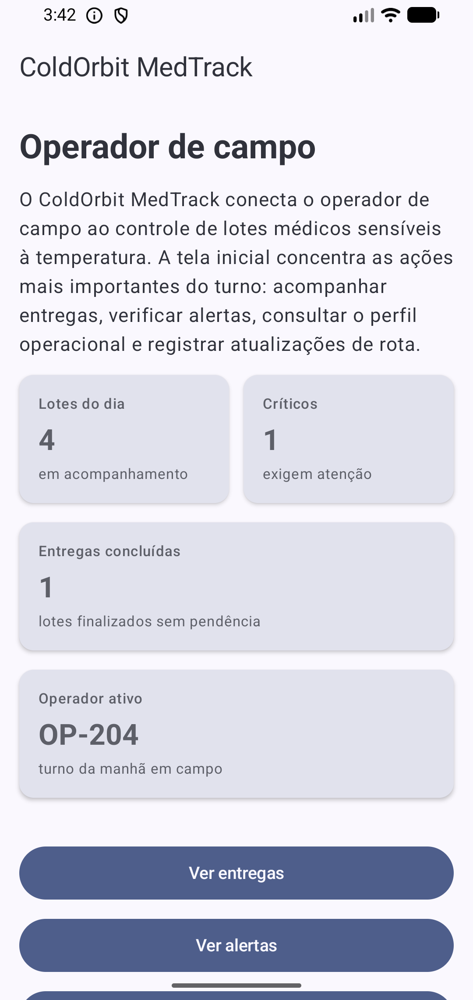
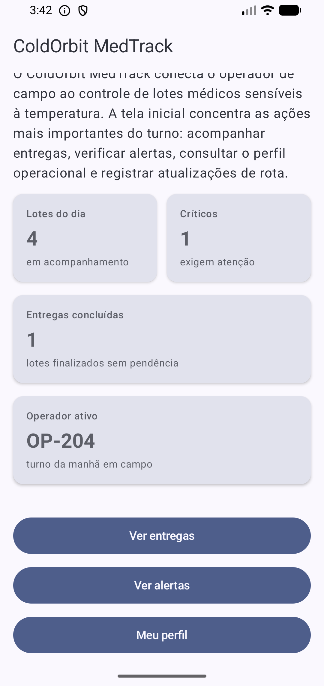
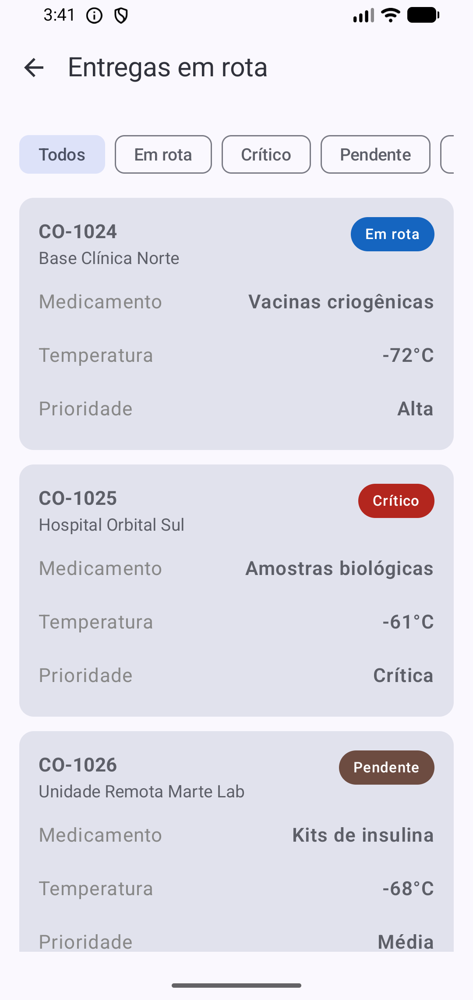
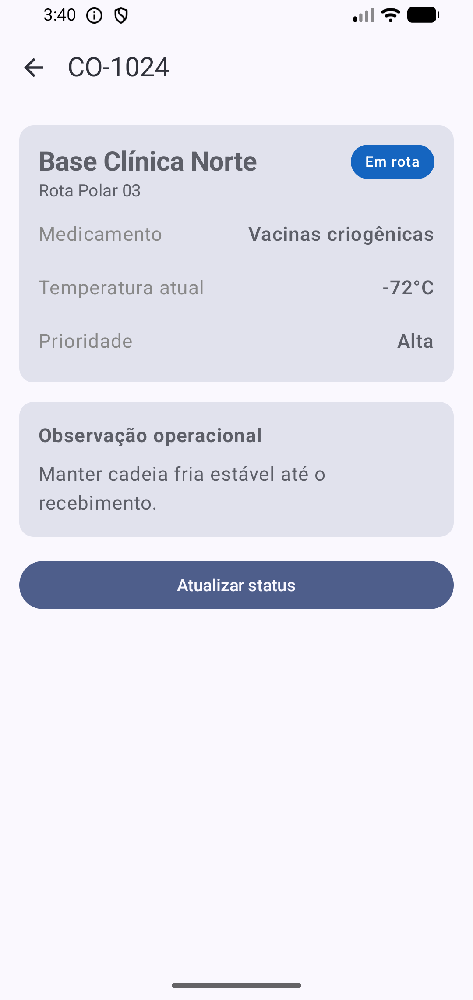
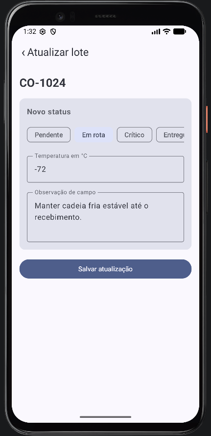
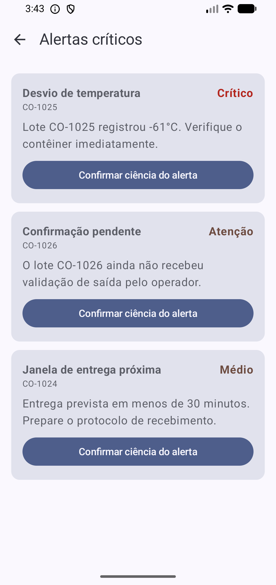
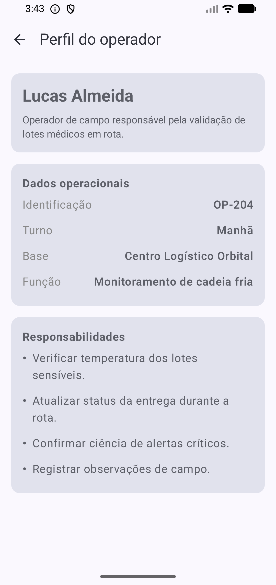

# ColdOrbit MedTrack

## Desenvolvido por:

RM: 558810     -    Karine Nascimento Honório da Silva

RM: 558539     -    Lucas Almeida Bel Correa

RM: 555377     -    Lucas Rodrigues Alves

---

## 1. Sobre o projeto

O **ColdOrbit MedTrack** é o aplicativo de campo da solução **ColdOrbit MedTrack**. A proposta do sistema é apoiar a operação de transporte de lotes médicos sensíveis à temperatura, como vacinas, medicamentos especiais e amostras biológicas.

Dentro da solução completa, o app Kotlin representa a visão do **operador em campo**. Por isso, ele não foi pensado como um dashboard administrativo complexo. O foco está em ações diretas durante a rota: consultar entregas, verificar lotes críticos, atualizar status, registrar temperatura, visualizar alertas e consultar o perfil operacional do usuário.

A relação com o tema da Global Solution está na aplicação de tecnologia para resolver problemas reais ligados à logística, saúde, rastreabilidade e monitoramento em ambientes críticos. O projeto simula uma cadeia fria monitorada, usando uma abordagem inspirada em operações espaciais e sistemas de controle de missão, mas aplicada a um problema terrestre: manter a segurança de lotes médicos durante o transporte.

---

## 2. Objetivo da aplicação

O objetivo do aplicativo é permitir que um operador acompanhe os lotes médicos sob sua responsabilidade e registre ações importantes durante a operação de campo.

Na prática, o app permite:

- visualizar um resumo do turno;
- acessar a lista de entregas em rota;
- filtrar lotes por status;
- abrir os detalhes de um lote específico;
- atualizar status, temperatura e observação operacional;
- consultar alertas críticos;
- confirmar ciência de alertas;
- visualizar informações do perfil do operador.

---

## 3. Dados mockados

O projeto utiliza **dados mockados**, ou seja, dados simulados criados diretamente no código.

Essa decisão foi tomada para manter a entrega alinhada ao conteúdo visto nos projetos Android de referência e evitar dependência de API, internet, banco de dados externo ou autenticação real.

Os dados mockados estão centralizados no arquivo:

```text
app/src/main/java/br/com/fiap/coldorbitmedtrack/repository/MockRepository.kt
```

Nesse arquivo são definidos:

- lotes médicos simulados;
- destinos;
- rotas;
- temperaturas;
- status de entrega;
- prioridades;
- observações;
- alertas operacionais.

Durante a execução do app, alguns desses dados podem ser alterados em memória, como o status e a temperatura de um lote ou a confirmação de ciência de um alerta. Essas alterações funcionam enquanto o app está aberto, mas não são persistidas em banco de dados.

---

## 4. Estrutura de pastas

A organização principal do projeto está dentro do pacote:

```text
app/src/main/java/br/com/fiap/coldorbitmedtrack/
```

Estrutura utilizada:

```text
coldorbitmedtrack/
├── MainActivity.kt
├── components/
│   └── StatusComponents.kt
├── model/
│   ├── DeliveryBatch.kt
│   └── FieldAlert.kt
├── navigation/
│   └── AppRoutes.kt
├── repository/
│   └── MockRepository.kt
├── screens/
│   ├── HomeScreen.kt
│   ├── DeliveriesScreen.kt
│   ├── BatchDetailScreen.kt
│   ├── UpdateStatusScreen.kt
│   ├── AlertsScreen.kt
│   └── ProfileScreen.kt
└── ui/
    └── theme/
        ├── Color.kt
        ├── Theme.kt
        └── Type.kt
```

### 4.1 MainActivity.kt

Arquivo principal da aplicação. Nele são configurados:

- o tema do app;
- o `rememberNavController()`;
- o `NavHost`;
- as rotas das telas;
- as listas em memória de lotes e alertas;
- as ações de atualização de status e confirmação de alertas.

### 4.2 components/

Pasta para componentes reutilizáveis.

Atualmente contém o arquivo `StatusComponents.kt`, usado para padronizar elementos visuais relacionados ao status dos lotes, evitando repetição de código nas telas.

### 4.3 model/

Pasta com os modelos de dados da aplicação.

- `DeliveryBatch.kt`: representa um lote médico em transporte.
- `FieldAlert.kt`: representa um alerta operacional relacionado aos lotes.

Esses modelos definem os campos utilizados pelas telas, como código do lote, destino, temperatura, prioridade, status e mensagem de alerta.

### 4.4 navigation/

Pasta responsável pelas rotas.

O arquivo `AppRoutes.kt` centraliza os nomes das rotas e as funções auxiliares para navegação com parâmetro, como abrir o detalhe de um lote usando seu identificador.

### 4.5 repository/

Pasta responsável pelos dados simulados.

O arquivo `MockRepository.kt` fornece as listas usadas no aplicativo. Ele substitui uma API ou banco de dados real nesta versão do protótipo.

### 4.6 screens/

Pasta com as telas principais do aplicativo.

Cada arquivo representa uma tela do fluxo:

- `HomeScreen.kt`
- `DeliveriesScreen.kt`
- `BatchDetailScreen.kt`
- `UpdateStatusScreen.kt`
- `AlertsScreen.kt`
- `ProfileScreen.kt`

### 4.7 ui/theme/

Pasta gerada pelo projeto Android para definição de tema visual, cores e tipografia.

---

## 5. Fluxo geral da aplicação

O fluxo principal começa na `HomeScreen`. A partir dela, o operador pode seguir para três áreas principais: entregas, alertas ou perfil.

```text
HomeScreen
├── DeliveriesScreen
│   └── BatchDetailScreen
│       └── UpdateStatusScreen
├── AlertsScreen
└── ProfileScreen
```

Passo a passo do uso:

1. O usuário abre o aplicativo e chega à tela inicial.
2. Na tela inicial, ele visualiza o resumo operacional do dia.
3. Ao tocar em **Ver entregas**, acessa a lista de lotes em rota.
4. Na lista, pode filtrar os lotes por status.
5. Ao selecionar um lote, abre a tela de detalhes.
6. Na tela de detalhes, pode consultar dados completos do lote.
7. Ao tocar em **Atualizar status**, acessa a tela de atualização.
8. Na tela de atualização, informa novo status, temperatura e observação.
9. Ao salvar, o app atualiza os dados em memória e retorna ao fluxo do lote.
10. Pela tela inicial, também é possível acessar alertas críticos.
11. Na tela de alertas, o operador pode confirmar ciência de um alerta.
12. Pela tela inicial, o operador também pode acessar seu perfil.

---

## 6. Telas da aplicação

### 6.1 HomeScreen

A `HomeScreen` é a tela inicial do aplicativo.

Ela apresenta o nome do app, uma descrição da solução e um resumo do turno do operador. Essa tela funciona como ponto de partida para a navegação.

Principais elementos:

- título do app;
- descrição do ColdOrbit MedTrack;
- cards com resumo do dia;
- botão para acessar entregas;
- botão para acessar alertas;
- botão para acessar perfil.

Integração com o projeto:

A tela inicial conecta o operador às áreas principais do app. Ela resume o estado da operação e direciona o usuário para as ações mais importantes.

**Prints da HomeScreen:**





---

### 6.2 DeliveriesScreen

A `DeliveriesScreen` lista os lotes médicos em rota.

Ela usa uma lista vertical para exibir os lotes mockados em cards. Também possui filtros para facilitar a visualização por status.

Principais elementos:

- lista de lotes;
- cards com código, destino, temperatura e status;
- filtros por status;
- clique no card para abrir os detalhes do lote.

Integração com o projeto:

Essa tela representa a rotina principal do operador: acompanhar os lotes sob sua responsabilidade. Ao selecionar um lote, o app navega para a `BatchDetailScreen`, enviando o identificador do lote selecionado.

**Print da DeliveriesScreen:**



---

### 6.3 BatchDetailScreen

A `BatchDetailScreen` mostra as informações completas de um lote selecionado.

Ela recebe o identificador do lote pela navegação, busca o lote correspondente na lista mockada em memória e apresenta os detalhes operacionais.

Principais elementos:

- código do lote;
- destino;
- rota;
- medicamento ou item transportado;
- temperatura atual;
- prioridade;
- status;
- observação operacional;
- botão para atualizar status.

Integração com o projeto:

Essa tela conecta a consulta de entregas com a ação de campo. Depois de analisar o lote, o operador pode seguir para a `UpdateStatusScreen` para registrar uma atualização.

**Print da BatchDetailScreen:**



---

### 6.4 UpdateStatusScreen

A `UpdateStatusScreen` simula uma ação real do operador em campo.

Nessa tela, o operador pode alterar informações do lote, como status, temperatura e observação. Ao salvar, os dados são atualizados na lista em memória.

Principais elementos:

- seleção de novo status;
- campo para informar temperatura;
- campo para observação;
- botão para salvar atualização.

Integração com o projeto:

A tela atualiza os dados mockados mantidos na `MainActivity`. Isso permite que o app simule uma operação real sem usar banco de dados ou API.

**Print da UpdateStatusScreen:**



---

### 6.5 AlertsScreen

A `AlertsScreen` mostra alertas críticos relacionados aos lotes.

Ela permite que o operador visualize ocorrências importantes e registre ciência do alerta.

Principais elementos:

- lista de alertas;
- cards com informações críticas;
- botão para confirmar ciência;
- indicação visual quando o alerta já foi confirmado.

Integração com o projeto:

Essa tela reforça a função operacional do app. Além de consultar entregas, o operador precisa reagir a alertas que podem comprometer a segurança da carga médica.

**Print da AlertsScreen:**



---

### 6.6 ProfileScreen

A `ProfileScreen` apresenta o perfil do operador de campo.

Ela mostra informações simuladas sobre o usuário responsável pela operação, como identificação, turno, base e função.

Principais elementos:

- nome do operador;
- função;
- turno;
- base operacional;
- responsabilidades;
- resumo do papel do operador no fluxo.

Integração com o projeto:

Essa tela ajuda a contextualizar quem está executando as ações dentro do app. Ela reforça que o Kotlin representa o aplicativo do operador em campo, enquanto outras partes da solução podem representar visões mais administrativas.

**Print da ProfileScreen:**



---

## 7. Navegação entre telas

A navegação foi implementada com **Navigation Compose**, seguindo a base dos projetos Android utilizados como referência.

No `MainActivity.kt`, o app cria o controlador de navegação com:

```kotlin
val navController = rememberNavController()
```

Depois, as telas são registradas no `NavHost`:

```kotlin
NavHost(
    navController = navController,
    startDestination = AppRoutes.HOME
) {
    composable(AppRoutes.HOME) { ... }
    composable(AppRoutes.DELIVERIES) { ... }
    composable(AppRoutes.ALERTS) { ... }
    composable(AppRoutes.PROFILE) { ... }
}
```

As rotas com parâmetro são usadas para abrir telas específicas de um lote:

```text
batchDetail/{batchId}
updateStatus/{batchId}
```

Assim, quando o operador seleciona um lote, o app sabe exatamente qual lote deve ser exibido ou atualizado.

---

## 8. Componentes Compose utilizados

O projeto utiliza componentes básicos do Jetpack Compose trabalhados nos exemplos Android:

- `Scaffold`
- `TopAppBar`
- `Column`
- `Row`
- `Card`
- `LazyColumn`
- `LazyRow`
- `FilterChip`
- `Button`
- `OutlinedTextField`
- `Text`
- `IconButton`

Esses componentes foram usados para montar uma interface simples, funcional e compatível com o escopo da prova.

---

## 9. Como executar o projeto

1. Abra o Android Studio.
2. Selecione **Open**.
3. Escolha a pasta do projeto.
4. Aguarde a sincronização do Gradle.
5. Selecione um emulador Android ou dispositivo físico.
6. Clique em **Run**.
7. Navegue pelo app a partir da `HomeScreen`.

---

## 10. Prints utilizados no README

Os prints do aplicativo foram referenciados a partir da pasta:

```text
kotlin-prints/
```

Arquivos utilizados:

```text
kotlin-prints/kotlin-home-1.png
kotlin-prints/kotlin-home-2.png
kotlin-prints/kotlin-entregas.png
kotlin-prints/kotlin-detalhes.png
kotlin-prints/kotlin-atualizar-lote.png
kotlin-prints/kotlin-alertas.png
kotlin-prints/kotlin-perfil.png
```

Para que as imagens apareçam corretamente no GitHub, mantenha a pasta `kotlin-prints` na raiz do repositório, no mesmo nível do arquivo `README.md`.

---

## 11. Observações finais

Este projeto é um protótipo acadêmico funcional. Ele demonstra navegação entre telas, uso de componentes Compose, dados mockados, interação com estado em memória e organização simples de pastas.

A aplicação não possui API, banco de dados, login real ou persistência local, pois o objetivo da entrega é demonstrar a construção de um app Android com Kotlin e Jetpack Compose dentro do conteúdo trabalhado em aula.
